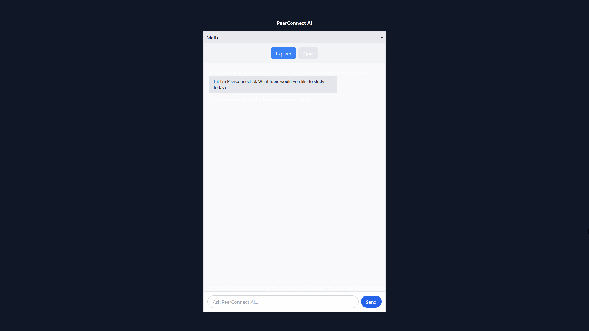
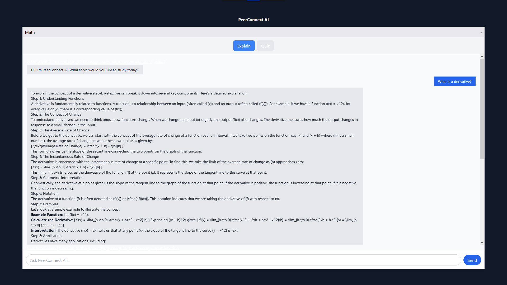
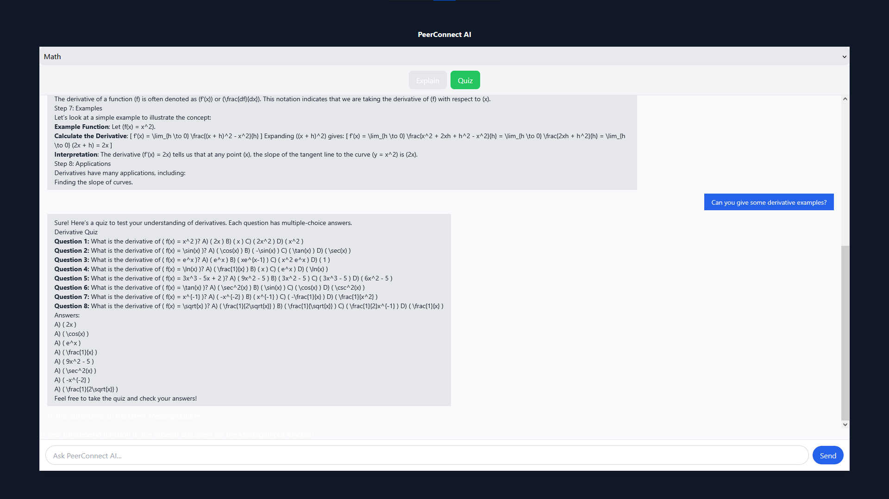

# **PeerConnect AI**


*("A single peer to connect to — your Tutor (btw, they're an AI)")*

---

## **Table of Contents**
1. [About the Project](#about-the-project)  
2. [Features](#features)    
3. [Getting Started](#getting-started)  
4. [License](#license)  
5. [Acknowledgements](#acknowledgments)

---

## **About the Project**
PeerConnect AI is a intelligent tutoring assistant built for a hackathon that's a study tool powered by NeuralSeek — a tool I developed solo in just 36 hours at [SBUHack 2025](https://sbuhacks-2025.devpost.com/).

---

## **Features**

*Get step-by-step explanations*


*Get quizzes for your topic of choice*
  


---

## **Getting Started**

```sh
git clone https://github.com/EmptySet-Exe/PeerConnect_AI.git
```

## *Front-End*
```sh
cd ./frontend
```

## *Back-End*
```sh
cd ./backend
```

Install dependencies:

```sh
npm i
```

> [!NOTE]
> You need to create a backend/.env file that holds your BACKEND_PORT (otherwise, default 3000) and a frontend/.env that holds your VITE_NEURALSEEK_API_KEY.

To start the app in dev mode:

```sh
backend/node index.js

frontend/npm run dev
```

---

## **License**
This project is licensed under the MIT License - see the [LICENSE](LICENSE) file for details.


---

## **Acknowledgments**: 
  We would like to thank the following individuals and resources for their contributions and inspiration:
  - **Stony Brook Computer Society**: For showcasing this project at the SBUHacks 2025.
  - **Stony Brook University**: For hosting the event and providing lodging, catering, and amenities.
  - **NeuralSeek**: For providing unlimited access to their AI platform for the duration of the event.
  - **The Sponsors**: For helping to make this event possible and presenting opportunities for career development.
  - **GitHub**: For hosting this project and enabling collaboration.  
  - **Stack Overflow Community**: For countless solutions and advice during development.
